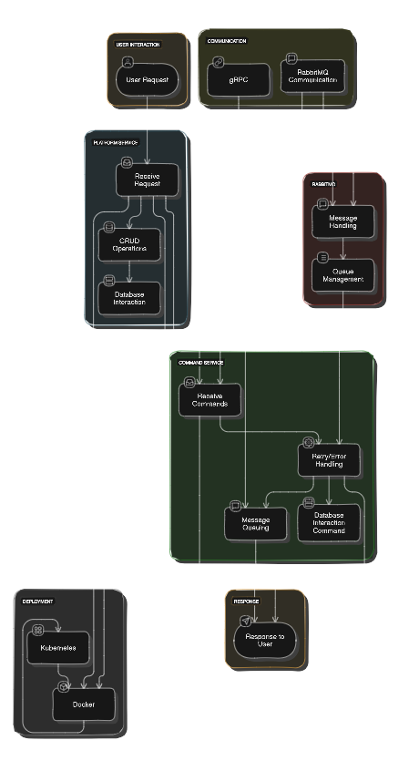

# **Nexus Command: Forging Platforms, Commanding Microservices**

Inspired by the forge of the gods, **Nexus Command** is a robust microservices architecture that brings together the power of platform management and command processing. Like the mythical Hephaestus crafting divine weapons, Nexus Command forges a powerful toolset for modern, scalable applications.

## 🌟 **Features**

- **Dual-Core Services**: Platform Service and Command Service, working in harmony like Castor and Pollux.
- **Kubernetes Orchestration**: Deploy with the precision of Zeus throwing thunderbolts.
- **Database Duality**: SQL Server for Platform Service, MongoDB for Command Service - a perfect balance of structure and flexibility.
- **gRPC Communication**: As swift and efficient as Hermes delivering messages between the gods.
- **RabbitMQ Messaging**: Asynchronous communication flowing like the River Styx.

## 🚀 **Quick Start**

Summon your Nexus Command instance with these divine incantations:

```bash
# Clone the repository
git clone https://github.com/yourusername/nexus-command.git

# Navigate to the project directory
cd nexus-command

# Build the Docker images
docker-compose build

# Launch the services
docker-compose up
```

Visit [http://localhost:8080](http://localhost:8080) to witness the power of Nexus Command!

## 🏛️ **Architecture**

Nexus Command is built on two pillars:

### **Platform Service**: The foundation of your digital Olympus.

- REST API for CRUD operations
- SQL Server database
- .NET Core powered

### **Command Service**: The executor of your godly decrees.

- MongoDB for flexible data storage
- gRPC endpoints for lightning-fast communication
- Asynchronous command processing

## 🏛️ **High-Level Flowchart**

Here is a high-level flowchart of the Nexus Command system architecture:



## 🛠️ **Technologies**

- **.NET Core**: The ambrosia of modern development
- **Docker**: Containing your services like Pandora's box (but safer!)
- **Kubernetes**: Orchestrating your services with the harmony of Apollo's lyre
- **SQL Server & MongoDB**: The Scylla and Charybdis of databases
- **gRPC & RabbitMQ**: Communication worthy of Olympian gods

## 📚 **Documentation**

Delve deeper into the mysteries of Nexus Command:

- [API Documentation](#)
- [Deployment Guide](#)
- [Contributing Guidelines](#)

## 🤝 **Contributing**

We welcome Promethean contributions! See our [Contributing Guidelines](#) for details on how to add your spark to the divine fire.

## 📜 **License**

Nexus Command is open-source software licensed under the [MIT license](LICENSE). Use it freely, as the gods intended.

## 🙏 **Acknowledgments**

Our gratitude to the titans of technology whose shoulders we stand upon:

- The Kubernetes community
- The .NET Core team
- The creators of gRPC and RabbitMQ

